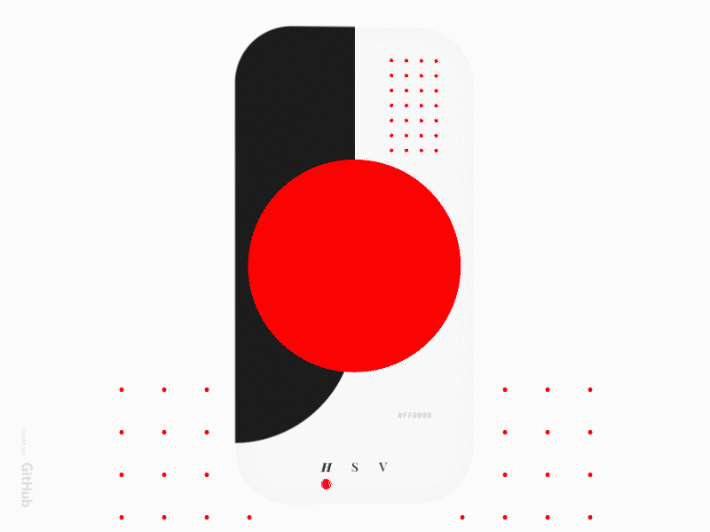

# colour-picker

Mobile UI interaction concept I developed a while ago and then decided to screencap and publish on [Dribbble](https://dribbble.com/shots/11083737-Mobile-Color-Picker).

## Getting Started

This is a very simple scene using mobile touch interactions to edit a color value. The project is done with Unity 2018.4.17f1 and written in .NET 4.X environment.

**NOTE** that the above preview image is a stylized and framed output. The project does not come with visual touch tracking elements or rounded bezels and the Postprocessing Stack is not included. Depending on your version please find this on the Unity Assetstore or on their [Github](https://github.com/Unity-Technologies/PostProcessing).

## License

This project is licensed under the MIT License, do with it as you will.
